 

<!-- HEADER SECTION -->
<h5 align="center" style="padding:0;margin:0;">Mariné du Plessis</h5>
<h5 align="center" style="padding:0;margin:0;">221326</h5>
<h6 align="center">Interactive Development 300</h6>
 

  <a href="https://github.com/username/projectname">
    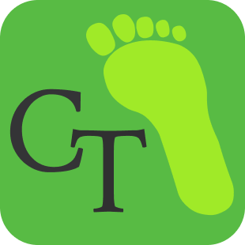
  </a>
  
  <h3 align="center">CarbonTrack</h3>

  

    Every Action Counts: Track, Learn, Reduce.  
    
    <a href="https://github.com/DupieM/duplessismarine_221326_carbontrack/issues">Report Bug</a>
    ·
    <a href="https://github.com/DupieM/duplessismarine_221326_carbontrack/issues">Request Feature</a>

<!-- TABLE OF CONTENTS -->
## Table of Contents

* [About the Project](#about-the-project)
  * [Project Description](#project-description)
  * [Built With](#built-with)
* [Getting Started](#getting-started)
  * [Prerequisites](#prerequisites)
  * [How to install](#how-to-install)
* [Features and Functionality](#features-and-functionality)
* [Concept Process](#concept-process)
   * [Ideation](#ideation)
   * [Wireframes](#wireframes)
   * [User-flow](#user-flow)
   * [ERD](#erd-diagram)
* [Development Process](#development-process)
   * [Implementation Process](#implementation-process)
        * [Highlights](#highlights)
        * [Challenges](#challenges)
   * [Reviews and Testing](#peer-reviews)
        * [Feedback from Reviews](#feedback-from-reviews)
        * [Unit Tests](#unit-tests)
   * [Future Implementation](#peer-reviews)
* [Final Outcome](#final-outcome)
    * [Mockups](#mockups)
    * [Video Demonstration](#video-demonstration)
* [Conclusion](#conclusion)
* [Roadmap](#roadmap)
* [Contributing](#contributing)
* [License](#license)
* [Contact](#contact)
* [Acknowledgements](#acknowledgements)

<!--PROJECT DESCRIPTION-->
## About the Project
<!-- header image of project -->

### Project Description

This term we were tasked to create and conceptualise any type of application for a problem we are currently facing from a list of options (Enviromental, Social, etc.) and to utilise some of the various AI technologies that are currently available. This application will consist of front-end and back-end requirements, as to create a real-world application that can aid or have a positive impact on a researched field. The mobile application I am creating will be used to calculate a users carbon footprint, visually showing them their carbon footprint data (current and history), while also giving them insights on their carbon footprint that was calculated, as well as general and specific tips on reducing their carbon footprint. 

### Built With

* 
* 
* 
* 
* 

<!-- GETTING STARTED -->
<!-- Make sure to add appropriate information about what prerequesite technologies the user would need and also the steps to install your project on their own mashines -->
## Getting Started

The following instructions will get you a copy of the project up and running on your local machine for development and testing purposes.

### Prerequisites

Ensure that you have the latest version of [Expo](https://docs.expo.dev/get-started/create-a-project/) installed on your machine. The Expo app for a mobile phone will also be required.

### How to install

### Installation
Clone the project repository as follow:

1. Go to Github Desktop and then click on clone new repository

2. Enter `https://github.com/DupieM/duplessismarine_221326_carbontrack.git` into the URL field and press the `Clone` button.

To start the Expo app and install dependancies on laptop:

1. Go to Visual Studio code   
   Open your Visual Studio code then click on File and then click on Open folder.
    Then navigate to where you have cloned the repository and open it.

2. Start terminal  
   Go to `Terminal` then click on new terminal.

3. Install dependencies  
   Enter `npm install` to get all the dependencies

4. Install latest Expo version  
   Enter `npm install expo@latest` to get latest version

5. Create your own .env file  
    Depending on the AI technology you are using (Google/OpenAi) add your `Private Keys` that you generated on either technology to this file.

6. Start the Expo server  
   Enter `npm start` to start Expo

To start the Expo app on a phone:

1. Go to Google play store or Apple play store   
   Open your plays tore and type in search field `Expo Go`.
   Click on the Expo Go app and then install it.

2. Open Expo Go app  
   After opening the app click on QR code and scan the QR code in the terminal of the app on Visual Studio

3. Start experimenting with the mobile application

<!-- FEATURES AND FUNCTIONALITY-->
<!-- You can add the links to all of your imagery at the bottom of the file as references -->
## Features and Functionality

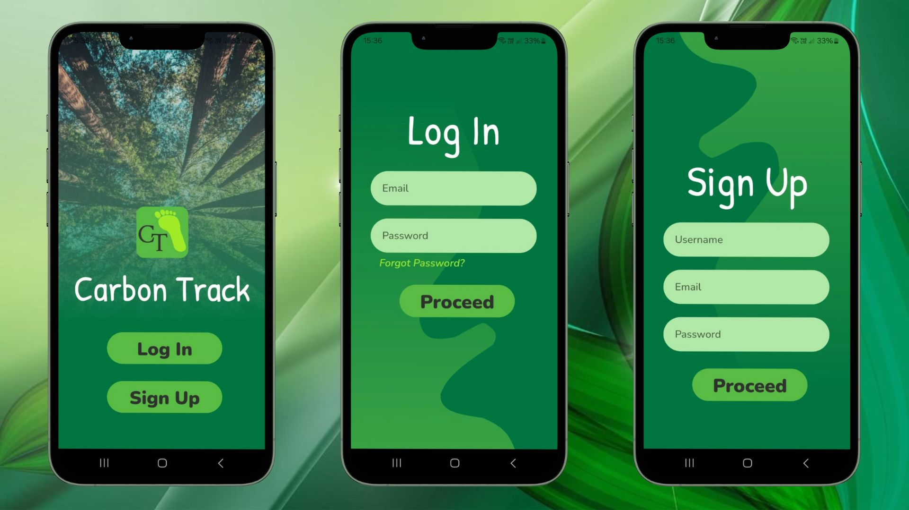
### Authentication Screens

A user can either create a new account or they can log in to an existing account that they have. A user is also able to change their password if they forgot it with the "Forgot Password" on the login screen, this will send an email to the user email adress to reset tha password.

 

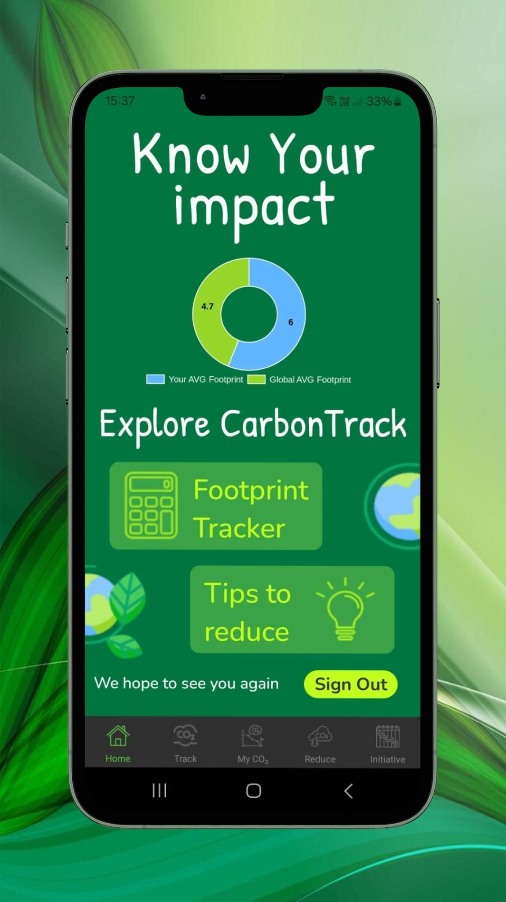

### Landing Screen

A new user will be able to see the global average carbon footprint for a single individual. An existing user is able to view their average carbon footprint calculated from their previous carbon footprints calculated on the app. Users can navigate to the Tracker screen and the Reduce screen from the Landing screen. Users can also sign out of their account on the landing screen.

 

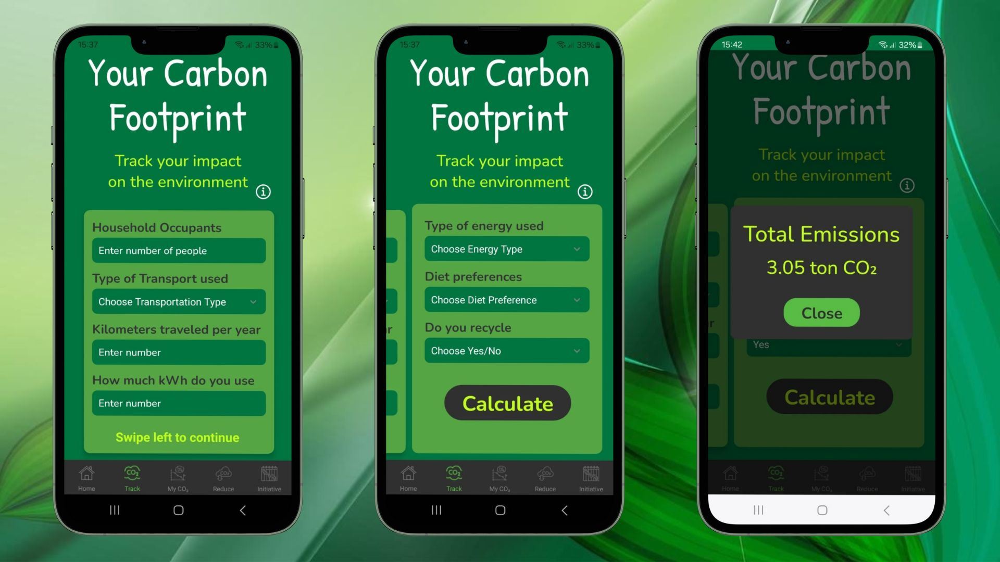

### Tracker Screen

Users will be able to calculate their carbon footprint here. Information can be viewed on how to fill in the form for the first time. Users are able to enter the necessary information to calculate their carbon footprint. The total emission for the user will be calculated and shown.

 

### My CO2 Screen

Users are able to view their current and previous carbon footprint (if available) in a bar chart. Users can also view a breakdown of their carbon footprint for the various emission categories. Lastly users will receive insights via AI on the breakdown of their carbon footprint data.

 

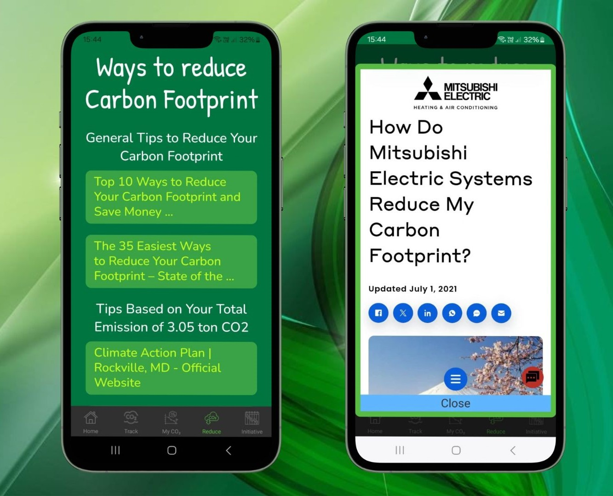

### Reduce Screen

Users are able to view and click through to articles on reducing their CO2 emissions in general and also to reduce their specific carbon footprint.

 

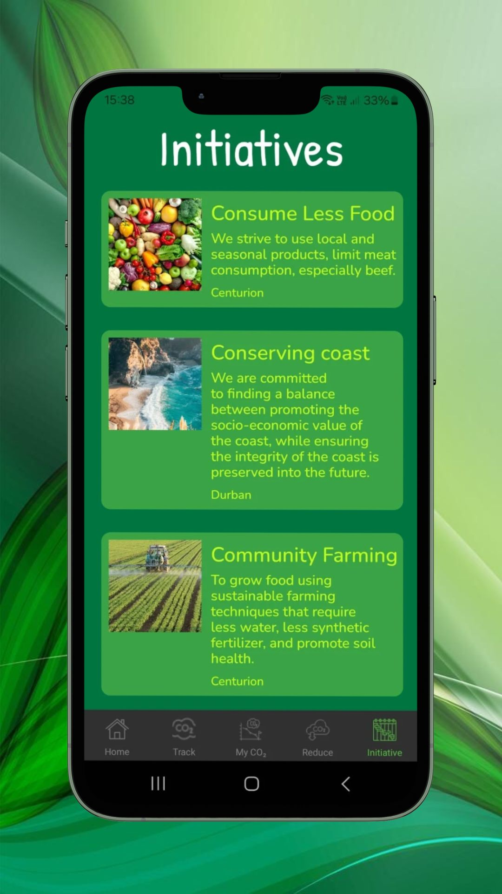

### Initiative Screen

Users are able to view available local initiatives in their community related to environmental projects.

<!-- CONCEPT PROCESS -->
<!-- Briefly explain your concept ideation process -->
## Concept Process

The `Conceptual Process` is the set of actions, activities and research that was done when starting this project.

### Ideation

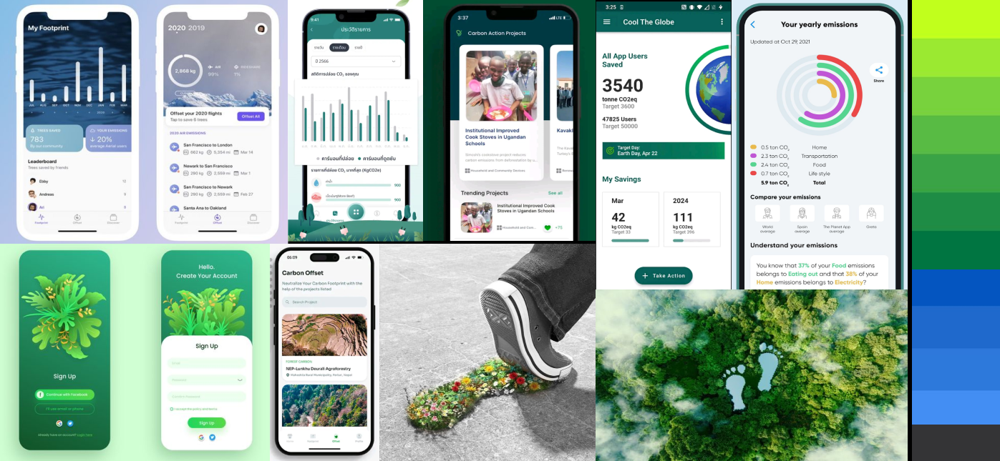

### Wireframes

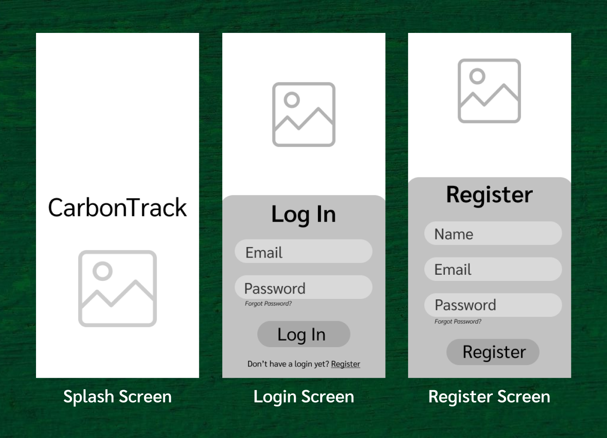
 
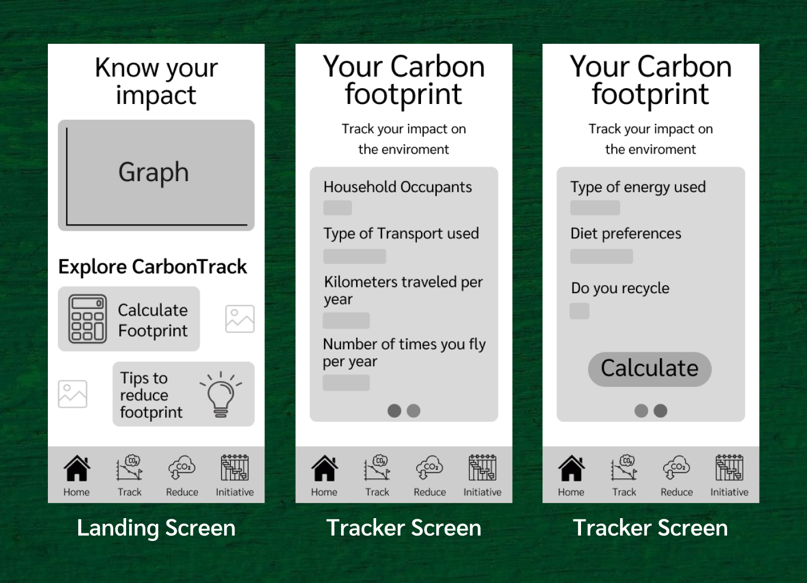
 
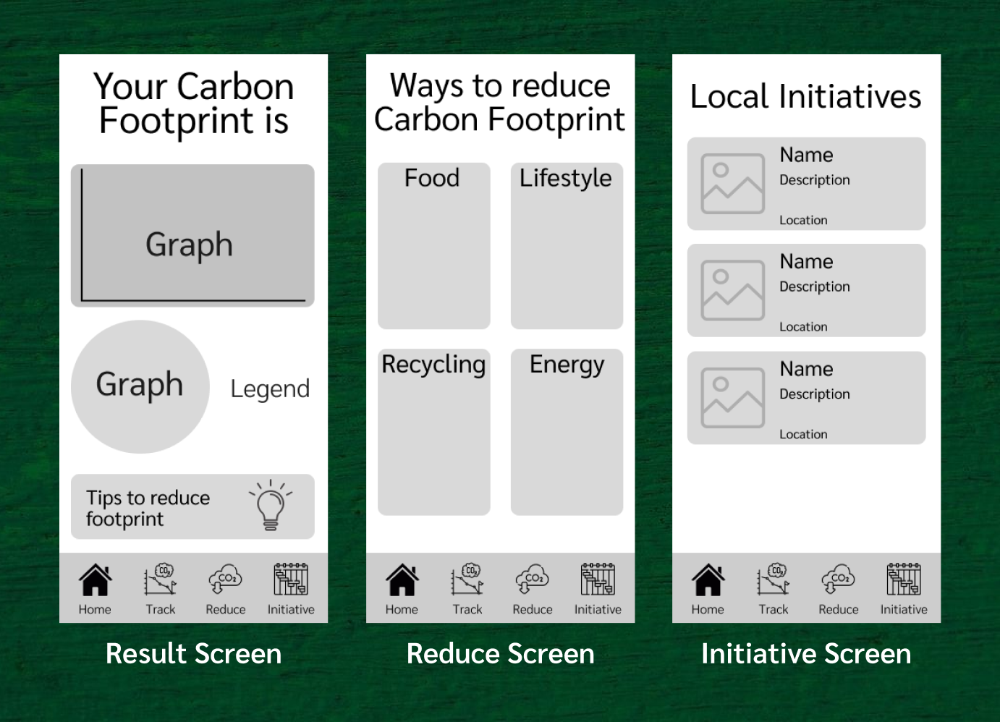

### User-flow

### ER-Diagram

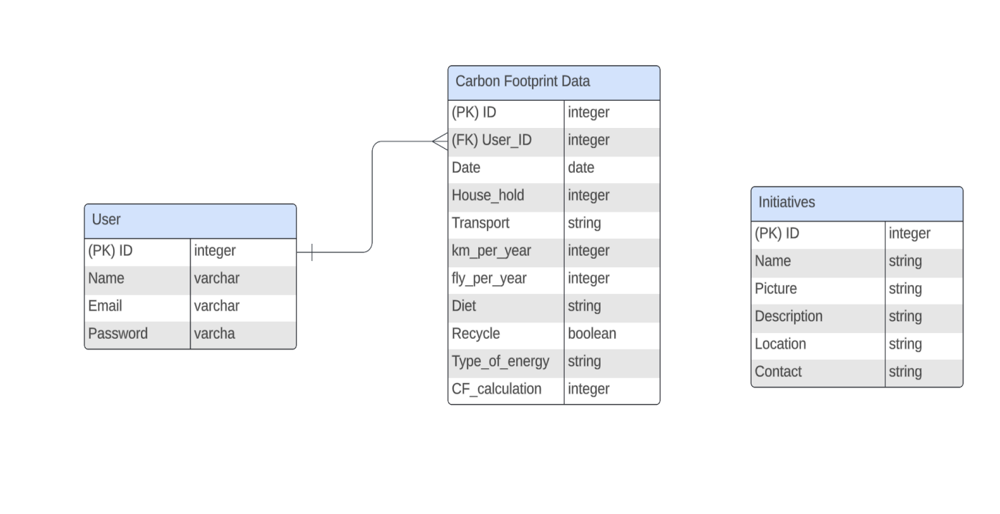

<!-- DEVELOPMENT PROCESS -->
## Development Process

The `Development Process` is the technical implementations and functionality done in the frontend and backend of the application.

### Implementation Process
<!-- stipulate all of the functionality you included in the project -->

* `Expo` was used to create a native Android app
* `OpenAI` was used to get insights on their carbon footprint data
* `Google Custom Search` was used to get reducing tips in general and for their total emission data
* `QuickChart` was used to display all the data on charts

#### Highlights
<!-- stipulated the highlight you experienced with the project -->
* To be able to implement two different types of AI 
* To be able to activate the forgot password to send a link to users email to reset it
* To be able to work natively on my computer and seeing the results on the mobile application

#### Challenges
<!-- stipulated the challenges you faced with the project and why you think you faced it or how you think you'll solve it (if not solved) -->
* Trying to find the correct calculation to be able to calculate a Carbon Footprint for an individual 
* When using the calculation it was challenging to understand and use the correct units of measure
* Implementing the two types of AI for the insights and custom search, especially understand how to use these technologies
* Creating another subcollection in an already existing subcollection in Firebase

### Reviews & Testing
<!-- stipulate how you've conducted testing in the form of peer reviews, feedback and also functionality testing, like unit tests (if applicable) -->

#### Feedback from Reviews

`Peer Reviews` were conducted by my fellow students. The following feedback was received:

General Feedback:
* Feedback received was positive and not many issues was experienced. The mobile app seems to be interesting to them and some of the functionality used like the 'card form' on the tracker screen impressed them.
* See below the average score of the questions asked with a scale of 1-10
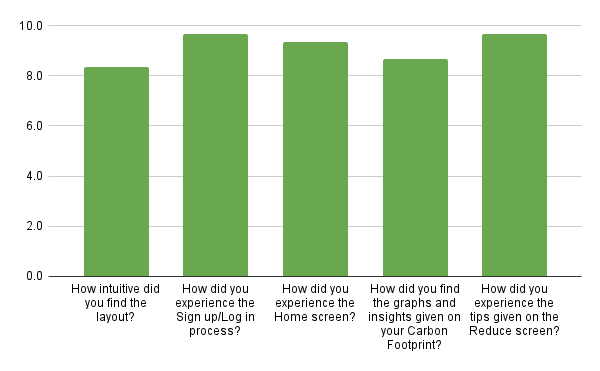

Observations made:
* The layout and the look and feel of the app was received positively and minor changes were suggested
* No assistance was required to fill in the form to track their carbon footprint, but it must be kept in mind that the testers are technological advanced
* The app seemed to be intuative overall and all the testers knew to click on the articles on the reduce screen without my help
* A question was asked if a profile screen must be added or not. Based on the feedback my assumption is that a profile screen will not really add value to the app.
* Data presented on the graphs seemed to be clearly understood

Improvents made:
* Corrections was made to language and some text displayed
* The addition of an info option to the tracker screen to help less technological inclined users to understand how the form works that must be filled in
* The reduce screen was further refined by splitting tips into a general section and then a section more specific towards the users total emission

#### Unit Tests

`Unit Tests` were conducted to establish working functionality. Here are all the tests that were ran:

* Test 1 of Authentication to make sure that username and password validation works and that the sign up and sign in function works
* Test 2 of Being able to see the average of all the users carbon footprint on the landing screen for an existing account
* Test 3 of Entering the necessary data on the form on tracker screen, then calculating the total emission correctly and confirming that it creates a second subcollection with the answers of the calculated carbon footprint, total and per category
* Test 4 of Displaying al the carbon footprint data inside the bar and polar area chart on the result screen
* Test 5 of Confirming that the OpenAi call works to request and receive insigts on the users carbon footprint data
* Test 6 of Confirming that the Google Custom Search works to bring back the reducing tips on the reduce screen, either just in general or for a specific emission given
* Test 7 of Confirming that the data displayed on the graphs is as the data recorded in the database

### Future Implementation
<!-- stipulate functionality and improvements that can be implemented in the future. -->

* To do a Google search for initiatives in the user's geographic area rather than reading it from a database
* To interface the phone number or email adress of the initiative to the phone or email functionality on the mobile phone so that the user can directly contact the person responsible for the initiative from the app

<!-- MOCKUPS -->
## Final Outcome

### Mockups

 

 

 

<!-- VIDEO DEMONSTRATION -->
### Video Demonstration

To see a run through of the application, click below:

[View Demonstration]()

<!-- ROADMAP -->
## Roadmap

See Future Implementation for a list of proposed features (and known issues).

<!-- CONTRIBUTING -->
## Contributing

Contributions are what makes the open-source community such an amazing place to learn, inspire, and create. Any contributions you make are **greatly appreciated**.

1. Fork the Project
2. Create your Feature Branch (`git checkout -b feature/AmazingFeature`)
3. Commit your Changes (`git commit -m 'Add some AmazingFeature'`)
4. Push to the Branch (`git push origin feature/AmazingFeature`)
5. Open a Pull Request

<!-- AUTHORS -->
## Authors

* **Mariné du Plessis** - [username](https://github.com/DupieM)

<!-- LICENSE -->
## License

CarbonTrack Rights reserved © 2024

<!-- LICENSE -->
## Contact

* **Mariné du Plessis** - [email@address](221326@virtualwindow.co.za) 
* **Project Link** - https://github.com/DupieM/duplessismarine_221326_carbontrack

<!-- ACKNOWLEDGEMENTS -->
## Acknowledgements
<!-- all resources that you used and Acknowledgements here -->
* [Expo Documentation](https://docs.expo.dev/)
* [Firebase Documentation](https://firebase.google.com/docs?hl=en&authuser=1&_gl=1*oj3ulf*_ga*MTQzMDEzOTU3OS4xNzEyNTU2NTU1*_ga_CW55HF8NVT*MTcxODU1NTAxMS44NS4xLjE3MTg1NTgxMDAuNTkuMC4w)
* [OpenAi Documentation](https://platform.openai.com/docs/concepts)
* [Google Cloud Documentation](https://cloud.google.com/docs)

