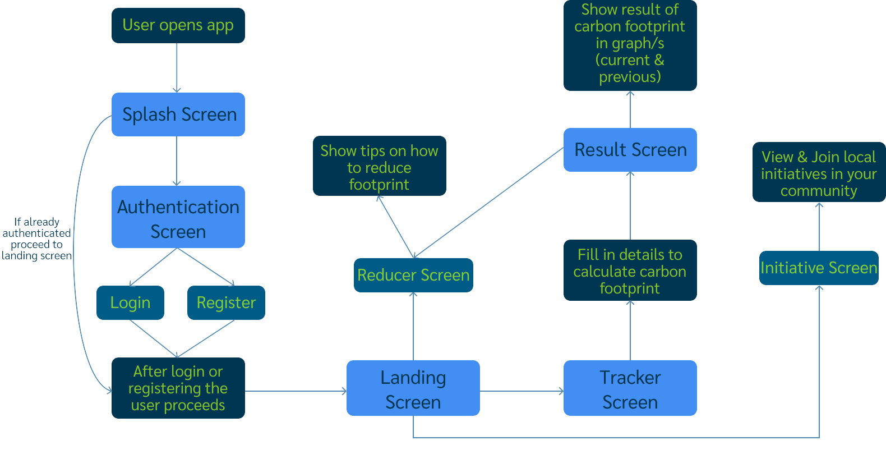

 

<!-- HEADER SECTION -->
<h5 align="center" style="padding:0;margin:0;">Mariné du Plessis</h5>
<h5 align="center" style="padding:0;margin:0;">221326</h5>
<h6 align="center">Interactive Development 300</h6>
 

  
  
  <h3 align="center">CarbonTrack</h3>

  

    Every Action Counts: Track, Learn, Reduce.  
    
    <a href="https://github.com/DupieM/duplessismarine_221326_carbontrack/issues">Report Bug</a>
    ·
    <a href="https://github.com/DupieM/duplessismarine_221326_carbontrack/issues">Request Feature</a>

<!-- TABLE OF CONTENTS -->
## Table of Contents

* [About the Project](#about-the-project)
  * [Project Description](#project-description)
  * [Built With](#built-with)
* [Getting Started](#getting-started)
  * [Prerequisites](#prerequisites)
  * [How to install](#how-to-install)
* [Features and Functionality](#features-and-functionality)
* [Concept Process](#concept-process)
   * [Ideation](#ideation)
   * [Wireframes](#wireframes)
   * [User-flow](#user-flow)
   * [ERD](#erd-diagram)
* [Development Process](#development-process)
   * [Implementation Process](#implementation-process)
        * [Highlights](#highlights)
        * [Challenges](#challenges)
   * [Reviews and Testing](#peer-reviews)
        * [Feedback from Reviews](#feedback-from-reviews)
        * [Unit Tests](#unit-tests)
   * [Future Implementation](#peer-reviews)
* [Final Outcome](#final-outcome)
    * [Mockups](#mockups)
    * [Video Demonstration](#video-demonstration)
* [Conclusion](#conclusion)
* [Roadmap](#roadmap)
* [Contributing](#contributing)
* [License](#license)
* [Contact](#contact)
* [Acknowledgements](#acknowledgements)

<!--PROJECT DESCRIPTION-->
## About the Project
<!-- header image of project -->

### Project Description

This term we were tasked to create and conceptualise any type of application for any problem we are facing from a list of options like (Enviromental, social, etc.) and to utilise some of the various AI technologies we went through in class. This application will consist of front-end and back-end requirements, as to create a real-world application that can aid or have a positive impact on researched field.The mobile application I am creating will be used to calculate a users carbon Footprint, show them their data on two charts, give insights on theri data that is calculated and will also give reducing tips for general and for their specific carbon footprint data.

### Built With

* 
* 
* 
* 
* 

<!-- GETTING STARTED -->
<!-- Make sure to add appropriate information about what prerequesite technologies the user would need and also the steps to install your project on their own mashines -->
## Getting Started

The following instructions will get you a copy of the project up and running on your local machine for development and testing purposes.

### Prerequisites

Ensure that you have the latest version of [Expo](https://docs.expo.dev/get-started/create-a-project/) installed on your machine. The Expo app for a mobile phone will also be required.

### How to install

### Installation
Clone the project repository as follow:

1. Go to Github Desktop and then click on clone new repository

2. Enter `https://github.com/DupieM/duplessismarine_221326_carbontrack.git` into the URL field and press the `Clone` button.

To start the Expo app and install dependancies on laptop:

1.  Go to Visual Studio code   
   Open your Visual Studio code then click on File and then click on Open folder.
    Then navigate to where you have cloned the repository and open it.

2.  Start terminal  
   Go to 'Terminal' then click on new terminal.

3.  Install dependencies  
   Enter 'npm install' to get all the dependencies

3.  Install latest Expo version  
   Enter 'npm install expo@latest' to get latest version

3.  Start the Expo server  
   Enter 'npm start' to start Expo

To start the Expo app on a phone:

1.  Go to Google play store or Apple play store   
   Open your plays tore and type in search field 'Expo Go'.
   Click on the Expo Go app and then install it.

2.  Open Expo Go app  
   After opening the app click on QR code and scan the QR code in the terminal of the app on Visual Studio

3. Start experimenting with the mobile application

<!-- FEATURES AND FUNCTIONALITY-->
<!-- You can add the links to all of your imagery at the bottom of the file as references -->
## Features and Functionality

###  Authentication

Description of Feature

 
 

### Feature 2

Description of Feature

 
 

### Feature 3

Description of Feature

 
 

<!-- CONCEPT PROCESS -->
<!-- Briefly explain your concept ideation process -->
## Concept Process

The `Conceptual Process` is the set of actions, activities and research that was done when starting this project.

### Ideation

### Wireframes

 

 

### User-flow

### ER-Diagram

<!-- DEVELOPMENT PROCESS -->
## Development Process

The `Development Process` is the technical implementations and functionality done in the frontend and backend of the application.

### Implementation Process
<!-- stipulate all of the functionality you included in the project -->

* Made use of both `functionality` to implement a specific feature.
* `MVC/MVVM` design architecture implemented.
* `Plugin` for this.
* ETC.

#### Highlights
<!-- stipulated the highlight you experienced with the project -->
* Sunshine.
* Rainbows.

#### Challenges
<!-- stipulated the challenges you faced with the project and why you think you faced it or how you think you'll solve it (if not solved) -->
* Bugs.
* Bugs.

### Reviews & Testing
<!-- stipulate how you've conducted testing in the form of peer reviews, feedback and also functionality testing, like unit tests (if applicable) -->

#### Feedback from Reviews

`Peer Reviews` were conducted by my fellow students and lecturer. The following feedback I found useful:

* Feedback one.
* Feedback two.

#### Unit Tests

`Unit Tests` were conducted to establish working functionality. Here are all the tests that were ran:

* Test 1 of this functionality
* Test 2 of this functionality

### Future Implementation
<!-- stipulate functionality and improvements that can be implemented in the future. -->

* Future 1.
* Future 2.

<!-- MOCKUPS -->
## Final Outcome

### Mockups

![image9][image9]
 
![image10][image10]

<!-- VIDEO DEMONSTRATION -->
### Video Demonstration

To see a run through of the application, click below:

[View Demonstration](path/to/video/demonstration)

<!-- ROADMAP -->
## Roadmap

See the [open issues](https://github.com/username/projectname/issues) for a list of proposed features (and known issues).

<!-- CONTRIBUTING -->
## Contributing

Contributions are what makes the open-source community such an amazing place to learn, inspire, and create. Any contributions you make are **greatly appreciated**.

1. Fork the Project
2. Create your Feature Branch (`git checkout -b feature/AmazingFeature`)
3. Commit your Changes (`git commit -m 'Add some AmazingFeature'`)
4. Push to the Branch (`git push origin feature/AmazingFeature`)
5. Open a Pull Request

<!-- AUTHORS -->
## Authors

* **Your Name & Surname** - [username](https://github.com/username)

<!-- LICENSE -->
## License

Distributed under the MIT License. See `LICENSE` for more information.\

<!-- LICENSE -->
## Contact

* **Your Name & Surname** - [email@address](mailto:email@address) - [@instagram_handle](https://www.instagram.com/instagram_handle/) 
* **Project Link** - https://github.com/username/projectname

<!-- ACKNOWLEDGEMENTS -->
## Acknowledgements
<!-- all resources that you used and Acknowledgements here -->
* [Resource Name](path/to/resource)
* [Resource Name](path/to/resource)
* [Resource Name](path/to/resource)
* [Resource Name](path/to/resource)
* [Resource Name](path/to/resource)

